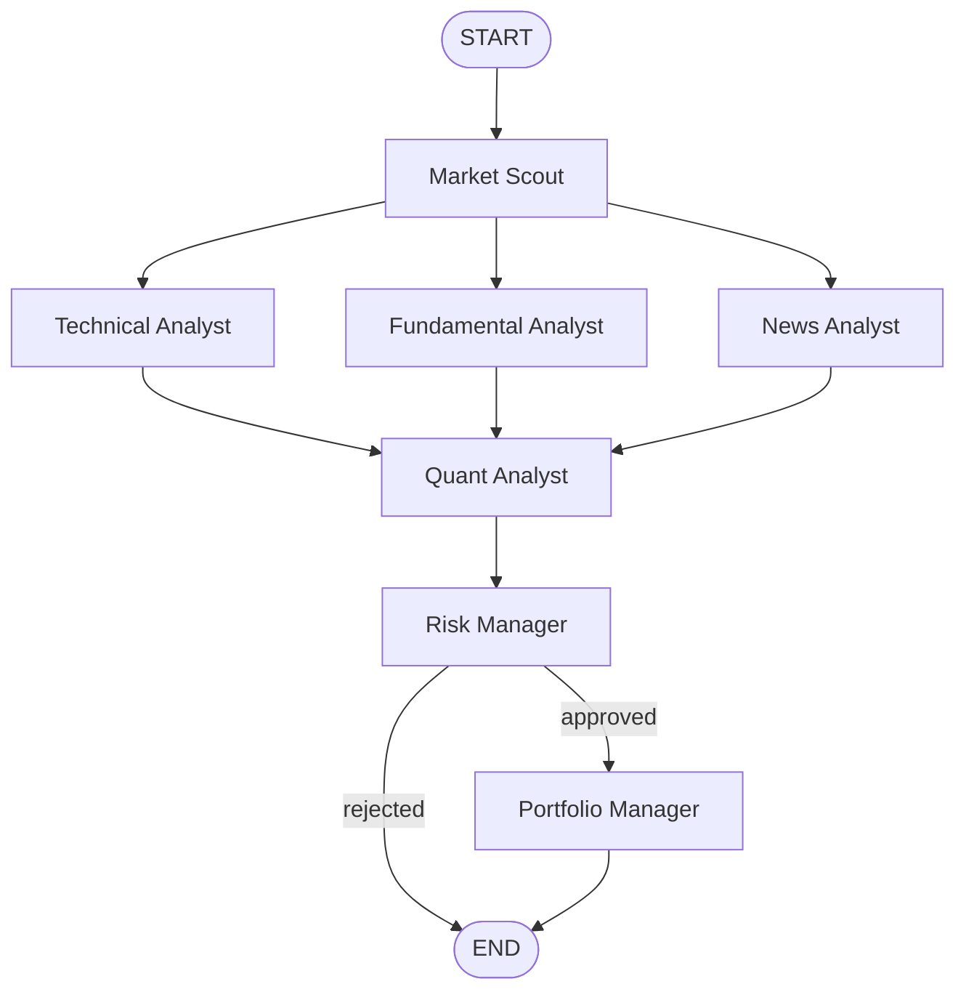

# AI Hedge Fund

A **complete, runnable** multi-agent investment research system. Seven specialized agents collaborate via [LangGraph](https://github.com/langchain-ai/langgraph) to scout opportunities, analyze technicals/fundamentals/news, score edge, enforce risk limits, and produce an investment memo.

> **Disclaimer — paper / research only.** This project is for education and experimentation. It is **not financial advice**. Do not use it to make real trading decisions without independent due diligence. Simulated scores and demo data do not predict future results.

## Architecture



| # | Agent | Role |
|---|-------|------|
| 1 | **Market Scout** | Finds & ranks opportunities |
| 2 | **Technical Analyst** | RSI, MACD, MAs, trend, bias |
| 3 | **Fundamental Analyst** | Financials & valuation |
| 4 | **News Analyst** | Headlines, catalysts, sentiment |
| 5 | **Quant Analyst** | Edge score, win probability, scenarios, factors |
| 6 | **Risk Manager** | Stress tests, downside, sizing — **can REJECT** |
| 7 | **Portfolio Manager** | Final investment memo + allocation |

## Stack

- Python 3.11+
- LangGraph + LangChain (+ `langchain-anthropic` for live mode)
- `yfinance` for market data
- Optional Alpaca (not required)
- **`--demo` mode** works with **no API keys** (canned data + rule-based agents, zero LLM calls)

## Setup

```bash
cd ai-hedge-fund
python -m venv .venv
source .venv/bin/activate   # Windows: .venv\Scripts\activate
pip install -e .

# Optional for live LLM analysis
cp .env.example .env
# edit .env and set ANTHROPIC_API_KEY=...
```

## Usage

```bash
# Full 7-agent analysis (demo — no API key)
python -m hedge_fund.cli analyze TSLA --demo

# Universe scan then deep-dive top name
python -m hedge_fund.cli scan --demo

# Live mode (requires ANTHROPIC_API_KEY; still uses yfinance for market data)
python -m hedge_fund.cli analyze AAPL
```

Or via the console script after install:

```bash
hedge-fund analyze TSLA --demo
```

## Project layout

```
ai-hedge-fund/
  README.md
  requirements.txt
  pyproject.toml
  .env.example
  .gitignore
  src/hedge_fund/
    __init__.py
    state.py          # TypedDict AgentState
    graph.py          # LangGraph wiring + conditional risk routing
    config.py
    cli.py
    demo_data.py
    llm.py            # optional Anthropic enrichment (skipped in --demo)
    agents/           # 7 agents
    tools/            # market_data, indicators, news
  examples/sample_output.md
  tests/test_graph_smoke.py
```

## Tests

```bash
pip install -e ".[dev]"
pytest -q
```

## License

MIT — use at your own risk. Not investment advice.
